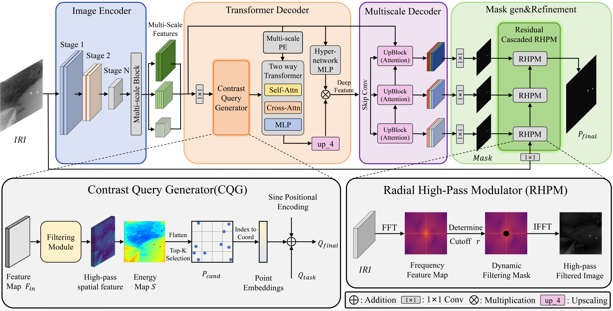

<p align="center">
  <h1 align="center">IR-SAM2: Target Enhancement with SAM2 for Infrared Small Target Detection (Remote Sensing 2026)</h1>
  <p align="center">
    <strong>Zongduo Hao</strong>&nbsp;&nbsp;
    <strong>Xiaocui Dang</strong>&nbsp;&nbsp;
    <strong>Yanyu Zhang</strong>&nbsp;&nbsp;
    <strong>Jinshui Miao</strong>&nbsp;&nbsp;
    <strong>Zhiming Li</strong>&nbsp;&nbsp;
    <strong>Xiankai Lu</strong>
  </p>
  <br>

Pytorch implementation for "[**IR-SAM2: Target Enhancement with SAM2 for Infrared Small Target Detection**](https://doi.org/10.3390/rs18121891)"

> **Abstract:** Foundation models such as the Segment Anything Model (SAM) have substantially advanced promptable object segmentation in remote sensing. However, extending these capabilities to infrared small target detection (IRSTD) remains highly challenging in the presence of severe background clutter and extremely low target visibility. In this paper, we propose IR-SAM2, an effective target enhancement framework for mask-level infrared small target segmentation in the IRSTD setting. Specifically, IR-SAM2 equips the SAM2 decoder with a dedicated frequency branch, facilitating simultaneous spatio-frequency learning and deep spatio-frequency fusion, while preserving SAM2's pre-trained knowledge. Moreover, we introduce a target-centric loss to better guide the model in distinguishing small targets from complex backgrounds. Extensive experiments show that IR-SAM2 achieves highly competitive performance on the IRSTD-1k and NUDT-SIRST benchmarks, while striking an optimal balance between detection probability and false alarm rate on NUAA-SIRST. The results further demonstrate the effectiveness of spatio-frequency cues for complex-scene infrared small target segmentation. The source codes have been made publicly available to support reproducibility.

<p align="center">
    
</p>

## Requirements
To install the requirements, you can run the following in your environment first:
```bash
pip install -r requirements.txt
```
To run the code with CUDA properly, you can comment out `torch` and `torchvision` in `requirement.txt`, and install the appropriate version of `torch` and `torchvision` according to the instructions on [PyTorch](https://pytorch.org/get-started/locally/).

Or you can use `uv` to install dependencies:
```bash
uv sync
```

## Datasets
For the dataset used in this paper, please download the following datasets [NUDT-SIRST](https://github.com/YeRen123455/Infrared-Small-Target-Detection) / [IRSTD-1k](https://github.com/RuiZhang97/ISNet) / [IRSTDID-SKY](https://github.com/xdFai/IRSTDID-800) / [NUDT-Sea](https://github.com/TianhaoWu16/Multi-level-TransUNet-for-Space-based-Infrared-Tiny-ship-Detection) and move them to `./dataset`.

Or you can access all the datasets we have collected via [Baidu Netdisk](https://pan.baidu.com/s/1FKV1m-RilwqQMcOjMyECbg?pwd=eq52).

## Results


## Qualitative Results
<p align="center">
    
</p>

## Citation
If you find our work and this repository useful. Please consider giving a star :star: and citation.
```bibtex
@article{hao2026ir,
  title={IR-SAM2: Target Enhancement with SAM2 for Infrared Small Target Detection},
  author={Hao, Zongduo and Dang, Xiaocui and Zhang, Yanyu and Miao, Jinshui and Li, Zhiming and Lu, Xiankai},
  journal={Remote Sensing},
  volume={18},
  number={12},
  pages={1891},
  year={2026},
  publisher={MDPI}
}
```


